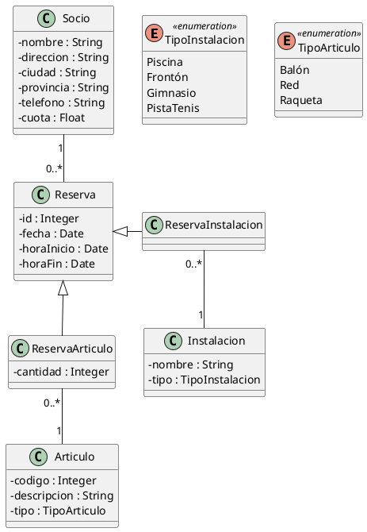

### Ejercicio 5. Instalaciones deportivas
Un centro de instalaciones deportivas quiere hacer una aplicación de reservas. En el centro existen instalaciones deportivas (piscinas, frontones, gimnasios y pistas de tesis). El centro en cuestión tiene socios, de los cuales se almacenan su nombre, dirección, ciudad, provincia, teléfono y cuota. Además, existen una serie de artículos que se pueden reservar si el socio lo requiere (balones, redes y raquetas). Cada instalación es reservada por un socio en una fecha dada desde una hora de inicio hasta una hora de fin. Cada reserva puede tener asociada uno o varios artículos deportivos que se alquilan a parte. Por ejemplo, si yo quiero hacer una reserva para jugar al tenis, tengo que reservar una instalación polideportiva y si lo necesito, las raquetas.

~~~
@startuml instdepor
'https://plantuml.com/class-diagram

skinparam classAttributeIconSize 0

enum TipoInstalacion << enumeration >> {
    Piscina
    Frontón
    Gimnasio
    PistaTenis
}

enum TipoArticulo << enumeration >> {
    Balón
    Red
    Raqueta
}

class Socio {
    - nombre : String
    - direccion : String
    - ciudad : String
    - provincia : String
    - telefono : String
    - cuota : Float
}

class Articulo {
    - codigo : Integer
    - descripcion : String 
    - tipo : TipoArticulo
}

class Instalacion {
    - nombre : String
    - tipo : TipoInstalacion
}

class Reserva {
    - id : Integer
    - fecha : Date
    - horaInicio : Date
    - horaFin : Date
}

class ReservaArticulo {
    - cantidad : Integer
}

class ReservaInstalacion {
}

Socio "1" -- "0..*" Reserva

Articulo "1" -up- "0..*" ReservaArticulo 
Instalacion "1" -up- "0..*" ReservaInstalacion 

Reserva <|-- ReservaArticulo
Reserva <|- ReservaInstalacion

@enduml
~~~

**Vista previa:**
